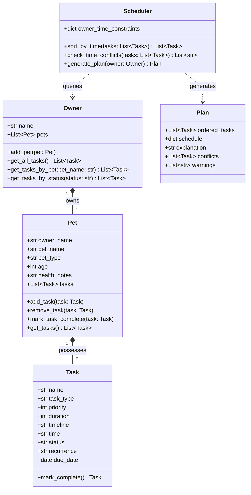

# Final System Architecture (UML)

```mermaid
classDiagram
    class Task {
        +str name
        +str task_type
        +int priority
        +int duration
        +str timeline
        +str time
        +str status
        +str recurrence
        +date due_date
        +mark_complete() Task
    }
    
    class Pet {
        +str owner_name
        +str pet_name
        +str pet_type
        +int age
        +str health_notes
        +List~Task~ tasks
        +add_task(task: Task)
        +remove_task(task: Task)
        +mark_task_complete(task: Task)
        +get_tasks() List~Task~
    }
    
    class Owner {
        +str name
        +List~Pet~ pets
        +add_pet(pet: Pet)
        +get_all_tasks() List~Task~
        +get_tasks_by_pet(pet_name: str) List~Task~
        +get_tasks_by_status(status: str) List~Task~
    }
    
    class Plan {
        +List~Task~ ordered_tasks
        +dict schedule
        +str explanation
        +List~Task~ conflicts
        +List~str~ warnings
    }
    
    class Scheduler {
        +dict owner_time_constraints
        +sort_by_time(tasks: List~Task~) List~Task~
        +check_time_conflicts(tasks: List~Task~) List~str~
        +generate_plan(owner: Owner) Plan
    }

    Owner "1" *-- "*" Pet : owns
    Pet "1" *-- "*" Task : possesses
    Scheduler ..> Plan : generates
    Scheduler ..> Owner : queries
```